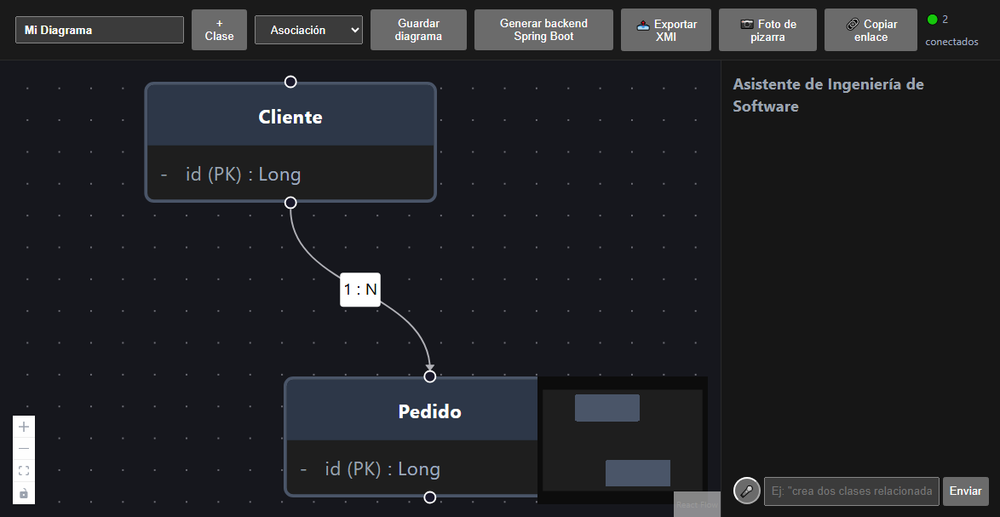

# Manual de Usuario: Sistema de Modelado UML Colaborativo en Tiempo Real con IA

**Proyecto:** Generador de Diagramas de Clases UML Colaborativo  
**Materia:** Sistemas de Información I (SW1)  
**Semestre:** 2-2026  
**Versión:** 1.0.0  

---

## 📋 Tabla de Contenidos
1. [Introducción y Acceso al Sistema](#1-introducción-y-acceso-al-sistema)
2. [Entorno de Trabajo y Navegación Principal](#2-entorno-de-trabajo-y-navegación-principal)
3. [Modelado Visual de Clases UML](#3-modelado-visual-de-clases-uml)
4. [Colaboración en Tiempo Real y Concurrencia](#4-colaboración-en-tiempo-real-y-concurrencia)
5. [Asistente de Diseño con Inteligencia Artificial (Gemini)](#5-asistente-de-diseño-con-inteligencia-artificial-gemini)
6. [Interoperabilidad con Enterprise Architect (XMI 2.1)](#6-interoperabilidad-con-enterprise-architect-xmi-21)
7. [Generación Automática de Código (Spring Boot 3 + Docker)](#7-generación-automática-de-código-spring-boot-3--docker)
8. [Uso de la Aplicación Móvil (Android / Flutter)](#8-uso-de-la-aplicación-móvil-android--flutter)
9. [Guía Rápida de Solución de Problemas (FAQ)](#9-guía-rápida-de-solución-de-problemas-faq)

---

## 1. Introducción y Acceso al Sistema

Este sistema permite a equipos de ingeniería de software diseñar diagramas de clases UML de forma colaborativa y simultánea, asistidos por inteligencia artificial generativa, con sincronización móvil offline y generación de arquitectura backend completa lista para producción.

### 🌐 Opciones de Acceso:
* **En la Nube (Producción con SSL):**  
  👉 [https://diagramasw1pracial100.duckdns.org](https://diagramasw1pracial100.duckdns.org)
* **En Entorno Local (Desarrollo):**  
  👉 `http://localhost:3000` (Frontend) | `http://localhost:8085` (Backend API)

---

## 2. Entorno de Trabajo y Navegación Principal

Al acceder al sistema, el usuario visualiza el espacio de trabajo central compuesto por el lienzo infinito interactivo y las herramientas superiores.

```
┌────────────────────────────────────────────────────────────────────────────────────────┐
│ [Logo] [Título Diagrama] | [👥 Presencia] | [🤖 Asistente IA] [💾 XMI] [⚡ Generar Código]│
├────────────────────────────────────────────────────────────────────────────────────────┤
│                                                                                        │
│                                 LIENZO INFINITO                                       │
│                                   (CANVAS)                                             │
│                                                                                        │
│               ┌───────────────┐               ┌───────────────┐                        │
│               │    Cliente    │───────────────│    Pedido     │                        │
│               └───────────────┘ 1           * └───────────────┘                        │
│                                                                                        │
├────────────────────────────────────────────────────────────────────────────────────────┤
│ [➕ Nueva Clase] [🔀 Auto-Organizar (Dagre)] [🔍 Zoom] [📱 Sincronizar Móvil]         │
└────────────────────────────────────────────────────────────────────────────────────────┘
```

### 📸 Captura 1: Interfaz Principal del Canvas de Trabajo
> *Guarda tu captura en `docs/screenshots/01_interfaz_principal.png`*



#### Elementos Clave de la Interfaz:
1. **Barra Superior:** Controles de exportación, generación de código, asistente IA y presencia de usuarios conectados.
2. **Lienzo (React Flow):** Soporta arrastre (pan), zoom con rueda del ratón y selección múltiple.
3. **Barra de Acciones Rápidas:** Botón para añadir clases, aplicar auto-layout y limpiar o centrar el lienzo.

---

## 3. Modelado Visual de Clases UML

### 3.1 Creación y Edición de Clases
1. Haz clic en el botón **"Nueva Clase"** en la barra de herramientas.
2. Se colocará un bloque en el lienzo con valores por defecto.
3. Haz doble clic sobre la clase para abrir el **Editor de Propiedades**:
   - **Nombre de la clase:** (ej. `Factura`, `Usuario`, `Producto`).
   - **Estereotipo:** Opcional (ej. `<<entity>>`, `<<service>>`, `<<abstract>>`).
   - **Atributos:** Agrega nombre, tipo (`String`, `Integer`, `Double`, `Boolean`, `Date`) y visibilidad:
     - `+` Público (`public`)
     - `-` Privado (`private`)
     - `#` Protegido (`protected`)
   - **Métodos:** Agrega nombre, parámetros y tipo de retorno (ej. `calcularTotal(): Double`).

### 📸 Captura 2: Formulario / Modal de Edición de Clase
> *Guarda tu captura en `docs/screenshots/02_edicion_clase.png`*


### 3.2 Creación de Relaciones entre Clases
1. Pasa el cursor sobre los conectores circulares (puertos) en los bordes de la clase origen.
2. Mantén presionado el clic y arrastra la línea hacia la clase destino.
3. En el menú emergente de la relación, selecciona:
   - **Tipo de Relación:**
     - **Asociación Simple** (Línea continua con flecha abierta).
     - **Agregación** (Rombo blanco hueco en el origen).
     - **Composición** (Rombo negro relleno en el origen).
     - **Herencia / Generalización** (Triángulo hueco en el destino).
     - **Dependencia** (Línea punteada).
   - **Multiplicidades:** Selecciona o escribe los valores en ambos extremos (`1`, `0..1`, `*`, `1..*`).
   - **Rol:** Descripción de la relación (ej. `contiene`, `administra`).

### 📸 Captura 3: Relación entre Clases y Multiplicidades
> *Guarda tu captura en `docs/screenshots/03_relaciones_multiplicidades.png`*


### 3.3 Auto-Organización Automática (Dagre Layout)
Si el diagrama tiene muchas clases desordenadas, pulsa el botón **"Auto-Organizar"**. El algoritmo jerárquico Dagre calculará automáticamente la distribución espacial óptima evitando que las flechas se crucen innecesariamente.

---

## 4. Colaboración en Tiempo Real y Concurrencia

El sistema permite que múltiples ingenieros o estudiantes editen el mismo modelo al mismo tiempo a través de internet.

### 4.1 Cómo invitar a un colaborador:
1. Copia la URL que contiene el identificador del diagrama (ejemplo: `https://diagramasw1pracial100.duckdns.org/?diagram=ID_UNICO`).
2. Envía el enlace a tu compañero.
3. Al entrar, aparecerá un **avatar con su nombre y color distintivo** en la esquina superior derecha indicando su presencia activa.

### 4.2 Sincronización Instantánea:
- **Movimiento de nodos:** Cuando un usuario arrastra una clase, se mueve fluidamente en la pantalla de todos los participantes conectados en menos de 50 ms.
- **Creación / Modificación:** Cada atributo nuevo o relación añadida se replica inmediatamente mediante WebSockets.

### 4.3 Control de Concurrencia (Bloqueo Pesimista):
Para evitar conflictos de edición donde dos usuarios intenten editar el mismo elemento a la vez:
- Cuando el **Usuario 1** abre el editor de una clase, el sistema emite el evento `lock-class`.
- La clase mostrará un **indicador de bloqueo visual (candado)** para el **Usuario 2**, impidiendo que se sobreescriban los datos.
- Al guardar o cancelar, se emite `unlock-class` liberando el elemento.

### 📸 Captura 4: Colaboración en Tiempo Real con Múltiples Usuarios
> *Guarda tu captura en `docs/screenshots/04_colaboracion_tiempo_real.png`*


---

## 5. Asistente de Diseño con Inteligencia Artificial (Gemini)

El sistema integra el modelo de última generación **Google Gemini 1.5** para acelerar el diseño de software.

### 5.1 Generación y Expansión Incremental por Chat:
1. Haz clic en el botón flotante del **Asistente IA (🤖)**.
2. Escribe una instrucción en lenguaje natural, por ejemplo:
   > *"Agrega el módulo de gestión de pagos con tarjeta y pasarela Stripe para los pedidos existentes."*
3. La IA analizará las clases ya presentes en el lienzo y agregará las nuevas entidades necesarias (`Pago`, `Transaccion`, `MetodoPago`) con sus atributos y relaciones correctas sin borrar el trabajo previo.

### 5.2 Reconocimiento de Pizarras Físicas (Visión Artificial / OCR):
1. En el panel de IA, haz clic en el ícono de **Cámara / Subir Imagen**.
2. Sube una fotografía de un diagrama de clases dibujado a mano en una pizarra o en un cuaderno.
3. El motor de visión procesará la imagen, detectará las cajas, textos y flechas, y transcribirá el boceto directamente a clases interactivas en tu canvas.

### 📸 Captura 5: Asistente IA Generando Clases y Análisis de Pizarra
> *Guarda tu captura en `docs/screenshots/05_asistente_ia.png`*


---

## 6. Interoperabilidad con Enterprise Architect (XMI 2.1)

El sistema implementa el estándar internacional **OMG XMI 2.1**, garantizando total compatibilidad bidireccional con herramientas CASE profesionales como **Sparx Systems Enterprise Architect**.

### 6.1 Exportar hacia Enterprise Architect:
1. Diseña tu modelo en la aplicación web.
2. En la barra superior, haz clic en **"Exportar XMI"**.
3. Se descargará un archivo con extensión `.xmi` (ejemplo: `diagrama_exportado.xmi`).
4. Abre **Enterprise Architect**:
   - Crea o abre un proyecto `.eap` / `.feap` / `.qea`.
   - Haz clic derecho sobre un Paquete en el *Project Browser* -> **Import/Export** -> **Import Package from XMI**.
   - Selecciona el archivo descargado y presiona **Import**. Todas las clases, métodos y relaciones aparecerán nativamente en Enterprise Architect.

### 6.2 Importar desde Enterprise Architect:
1. En Enterprise Architect, selecciona tu paquete con el diagrama -> **Import/Export** -> **Export Package to XMI (versión 2.1)**.
2. En nuestra aplicación web, presiona el botón **"Importar XMI"**.
3. Selecciona el archivo `.xmi` o `.xml`.
4. El sistema parseará la estructura OMG UML y dibujará instantáneamente las clases con auto-organización en el lienzo.

### 📸 Captura 6: Botones de Importación/Exportación XMI y Modelo en Enterprise Architect
> *Guarda tu captura en `docs/screenshots/06_enterprise_architect_xmi.png`*


---

## 7. Generación Automática de Código (Spring Boot 3 + Docker)

A diferencia de diagramadores convencionales que solo generan diagramas visuales, este sistema genera un **backend microservicio completo y ejecutable**.

### 7.1 Pasos para Generar y Ejecutar el Código:
1. Con tu diagrama terminado en el lienzo, presiona el botón **"⚡ Generar Código"**.
2. El navegador descargará un archivo comprimido: `backend-springboot.zip`.
3. Descomprime el archivo. Observarás la siguiente arquitectura empresarial generada:

```
backend-springboot/
├── pom.xml                                   <- Java 17 + Spring Boot 3.3.4
├── Dockerfile                                <- Multi-stage build para producción
├── docker-compose.yml                        <- Orquestación con PostgreSQL 16
└── src/main/java/com/example/demo/
    ├── entity/        <- Entidades JPA (@Entity, @Table, @ManyToOne, etc.)
    ├── repository/    <- Repositorios Spring Data JPA (JpaRepository)
    ├── service/       <- Lógica de negocio (@Service, @Transactional)
    ├── controller/    <- Controladores REST con OpenAPI / Swagger (@RestController)
    └── DemoApplication.java
```

### 7.2 Levantar el Backend con un Solo Comando:
Abre una terminal en la carpeta descomprimida y ejecuta:
```bash
docker compose up -d
```
El contenedor compilará el código Java, levantará PostgreSQL 16, creará las tablas automáticamente según las clases del diagrama y expondrá los endpoints.

### 7.3 Probar la API en Swagger UI:
Abre tu navegador en:
👉 `http://localhost:8080/swagger-ui.html`  
Podrás ver todos los endpoints CRUD (`GET`, `POST`, `PUT`, `DELETE`) generados para cada clase y probar inserciones de datos en vivo.

### 📸 Captura 7: Código Java Generado y Swagger UI Activo
> *Guarda tu captura en `docs/screenshots/07_codigo_generado_swagger.png`*


---

## 8. Uso de la Aplicación Móvil (Android / Flutter)

La solución incluye un cliente móvil nativo diseñado con enfoque **Offline-First**, permitiendo modelar en campo, auditorías de sistemas o en lugares sin conexión a internet.

### 8.1 Instalación de la Aplicación Móvil:
1. Copia el archivo `ExamenSW1.apk` ubicado en la raíz del proyecto a tu teléfono Android.
2. Abre el archivo en el teléfono y selecciona **Instalar** (habilitar "Permitir orígenes desconocidos" si Android lo solicita).

### 8.2 Configuración de Conexión:
- Al abrir la aplicación, pulsa en el ícono de **Ajustes / Conexión (⚙️)**.
- Ingresa la dirección del servidor:
  - Si estás en la misma red Wi-Fi local: `http://192.168.0.7:8085`
  - Si usas el servidor en la nube: `https://diagramasw1pracial100.duckdns.org`
- Pulsa **"Probar Conexión"**. Aparecerá un mensaje verde confirmando la comunicación.

### 8.3 Creación de Clases mediante Comandos de Voz:
1. Pulsa el botón flotante del **Micrófono (🎙️)**.
2. Dicta en voz clara:
   > *"Crear clase Medico con atributos nombre texto y especialidad texto"*
3. El motor de reconocimiento de voz transcribirá el comando, creará la clase en la base de datos local SQLite y la sincronizará automáticamente con el servidor central.

### 📸 Captura 8: App Móvil Android en Funcionamiento y Dictado por Voz
> *Guarda tu captura en `docs/screenshots/08_app_movil_flutter.png`*


---

## 9. Guía Rápida de Solución de Problemas (FAQ)

### ¿Qué hacer si no se visualiza el canvas al entrar?
- Asegúrate de haber iniciado sesión con las credenciales registradas o crea una cuenta nueva desde la pantalla de login.
- Verifica que el backend esté en ejecución (`http://localhost:8085/api/docs` o en la URL pública).

### ¿Cómo resolver si el móvil no conecta a la IP local?
- Asegúrate de que tanto tu computadora como el teléfono celular estén conectados a la **misma red Wi-Fi**.
- Verifica que el firewall de Windows permita tráfico entrante en el puerto `8085`.
- Alternativamente, utiliza la URL pública con HTTPS: `https://diagramasw1pracial100.duckdns.org`.

### ¿Dónde se guardan los archivos XMI generados?
- Al pulsar "Exportar XMI", el navegador guarda el archivo directamente en la carpeta de **Descargas** de tu ordenador con el nombre del diagrama y la fecha actual.

---

## 📌 Resumen de Ubicación de Capturas de Pantalla

Para que las imágenes se visualicen automáticamente tanto en este documento como en cualquier visor de Markdown (GitHub, VS Code), guarda tus capturas con los siguientes nombres en la carpeta `docs/screenshots/`:

| Nombre de Archivo | Descripción de la Captura Requerida |
|-------------------|--------------------------------------|
| `01_interfaz_principal.png` | Vista general del lienzo con una o dos clases creadas. |
| `02_edicion_clase.png` | Formulario donde se editan los atributos y métodos de una clase. |
| `03_relaciones_multiplicidades.png` | Detalle de una relación con sus multiplicidades (1..*). |
| `04_colaboracion_tiempo_real.png` | Dos navegadores lado a lado mostrando la sincronización en vivo. |
| `05_asistente_ia.png` | Ventana del chat con la IA respondiendo o sugiriendo entidades. |
| `06_enterprise_architect_xmi.png` | El archivo XMI importado dentro de Enterprise Architect. |
| `07_codigo_generado_swagger.png` | Pantalla de Swagger UI (`/swagger-ui.html`) con los endpoints Java. |
| `08_app_movil_flutter.png` | Foto o captura de pantalla de la app en el teléfono celular Android. |
